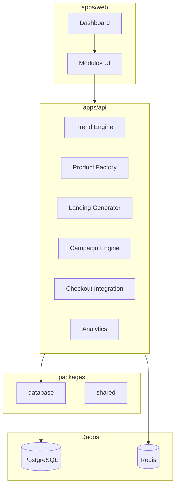

# Máquina de Vendas — AI Infoproduct Operating System

Plataforma para **pesquisar tendências**, **fabricar infoprodutos com IA**, **gerar landing pages**, **criar campanhas**, **publicar checkout (Cakto)** e **medir resultados** — por workspace (multi-tenant).

> Não é CRM. Não há pipeline de vendas, leads ou kanban comercial.

## Visão geral



## Módulos de negócio

| Módulo | API prefix | Responsabilidade |
|--------|------------|------------------|
| **Trend Engine** | `/trends` | Reddit/TikTok trends, oportunidades, pesquisa viral |
| **Product Factory** | `/products`, `/offers` | Ebook, oferta, copy, posicionamento, estrutura, preço |
| **Landing Generator** | `/landing-pages` | Seções IA, CTA, VSL, depoimentos, estrutura deployável |
| **Campaign Engine** | `/campaigns` | Ângulos, criativos, hooks, variações de teste |
| **Checkout** | `/integrations`, `/sales` | Cakto, publicação, checkout, webhooks de venda |
| **Analytics** | `/analytics` | Receita, conversão, performance de produto/campanha |

Cada módulo vive em `apps/api/src/modules/<nome>/` com `routes.ts` e, no futuro, `services/`, `jobs/`.

## Estrutura do monorepo

```
apps/
  api/src/modules/     # Rotas e lógica por módulo
  web/src/app/(dashboard)/  # Shell do produto
packages/
  database/src/schema/ # Entidades de domínio
  shared/src/          # Zod, constantes, definição dos módulos
```

## Modelo de dados

Entidades centrais (todas com `organizationId`):

| Tabela | Papel |
|--------|--------|
| `products` | Infoproduto (ebook, curso, bundle) |
| `offers` | Oferta com copy e pricing sugerido |
| `campaigns` | Campanhas e variações criativas |
| `landing_pages` | Páginas geradas (seções JSON, deploy) |
| `trends` | Tendências descobertas (Reddit, TikTok) |
| `generated_assets` | Artefatos IA (por módulo/tipo) |
| `sales` | Vendas (webhook Cakto) |
| `integrations` | Conexões externas (Cakto, etc.) |

Base de tenancy: `users`, `organizations`, `memberships` (inalterado).

## Fases de implementação

1. **Fundação** (concluída): monorepo, Docker, Drizzle, health, shell dashboard
2. **Auth + workspace**: sessões, RBAC, contexto `organizationId`
3. **Trend Engine**: ingestão Reddit/TikTok (APIs oficiais / fetch server-side)
4. **Product Factory**: pipelines de geração (LLM), assets em `generated_assets`
5. **Landing + Campaign**: geração estruturada, preview estático
6. **Checkout**: OAuth/API Cakto, webhooks → `sales`
7. **Analytics**: agregações sobre `sales` e eventos de campanha

## Capacidades futuras (apenas preparadas na arquitetura)

Reservado em design, **sem implementar agora**:

| Capacidade | Preparação |
|------------|------------|
| Playwright / browser automation | Campo `metadata` em assets; módulo documentado |
| Gamma automation | `generated_assets.assetType` extensível |
| WebSocket realtime | Redis presente; sem WS no API ainda |
| Filas complexas | Redis; jobs simples em fase posterior (`BullMQ` TBD) |

## Stack (inalterada)

TypeScript · pnpm · Turborepo · Next.js 15 · Hono · Drizzle · PostgreSQL 16 · Redis 7 · Zod

## UX (web)

Referências: **Vercel**, **Stripe**, **Linear**, **Framer**.

- Dark, minimal, tipografia limpa
- Sidebar fixa com módulos (não pipeline CRM)
- Overview com métricas-chave (quando houver dados)
- Sem kanban de vendas nem visual de funil CRM

## Convenções

- IDs: UUID (`defaultRandom()`)
- JSONB para conteúdo gerado por IA (seções, copy, criativos)
- `generated_assets.module` enum alinhado aos módulos da API
- Timestamps: `createdAt`, `updatedAt`
